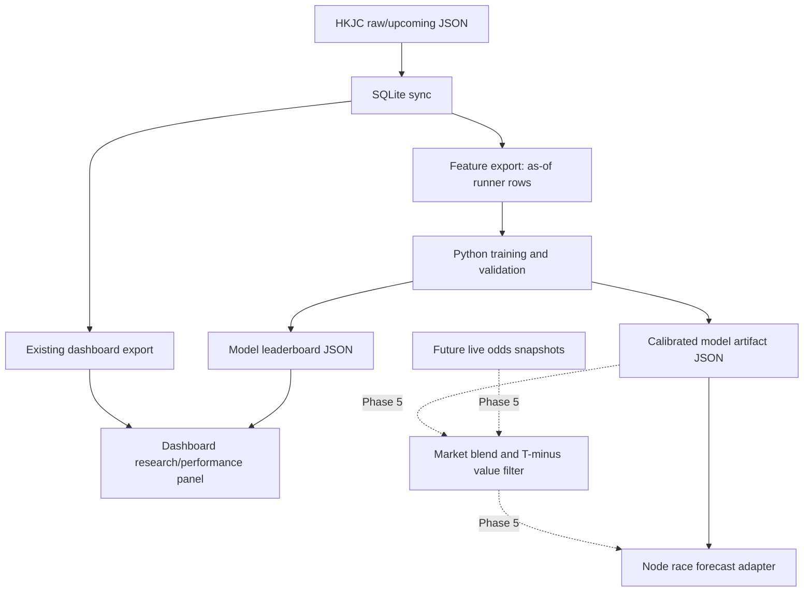

# HKJC Historical Training and Strategy Optimization Design

## Decision summary

We will build a local-first model training and strategy optimization layer on top of the existing HKJC SQLite database. The first production version should improve probability quality and backtest honesty before changing cash betting advice. It will not try to promise a winning system. It will answer a narrower, testable question: given only information available before a race, which model and staking rules produce the best calibrated probabilities, controlled drawdown, and positive expected-value signals across historical HKJC races?

The recommended architecture is a hybrid stack:

- Node.js remains responsible for HKJC collection, SQLite sync, dashboard export, browser UI, and lightweight race-day recommendations.
- Python is introduced only for offline model training, model comparison, calibration, and report generation.
- Training artifacts are exported as JSON so the existing Node dashboard can consume them without loading the full history on mobile.

## Research basis

The design borrows five ideas from the academic and open-source landscape.

1. **Fundamental probability model plus public market probability.** William Benter's Hong Kong horse-racing system used a fundamental handicapping model, public implied probabilities, expected return, and Kelly-style staking. We should not treat our model and the public market as rivals; we should learn how to blend them when live or final odds are available.
   - Source: https://gwern.net/doc/statistics/decision/1994-benter.pdf

2. **Ranking probabilities need correction.** Harville / Plackett-Luce style models are useful for transforming win probabilities into exacta, quinella, place, trio, and top-k probabilities, but the literature shows systematic bias for second and third-place estimates. We should keep the current ranking engine as a baseline and add empirical calibration by pool and field structure.
   - Source: https://www.stat.berkeley.edu/~aldous/157/Papers/ali.pdf

3. **Calibration is more important than raw accuracy for betting.** Sports betting research shows that models selected for calibration can outperform models selected for accuracy when the action is expected-value betting. Our model leaderboard must use Brier score, log loss, calibration gap, ROI, drawdown, and turnover, not top-pick hit rate alone.
   - Source: https://arxiv.org/abs/2303.06021

4. **Modern systems separate data, features, models, backtest, risk, and UI.** Current open-source HKJC/horse-racing projects commonly separate as-of features, model training, walk-forward backtests, live odds snapshots, Kelly/risk modules, and dashboards.
   - Source: https://github.com/stevw-repo/HKJC-Horse-Racing-ML-Research-Project
   - Source: https://github.com/codeworks-data/mvp-horse-racing-prediction
   - Source: https://github.com/acmayuen/HK-Horse-Racing
   - Source: https://github.com/gmalbert/horse-racing-predictions

5. **Deep learning is a future path, not the first production path.** Recent AI-for-racing discussion points toward neural networks, computer vision, and game-theoretic systems, but our current dataset is tabular and our first need is calibrated probabilities. We should start with interpretable baselines and gradient boosting before adding deep models.
   - Source: https://arxiv.org/abs/2207.04981

## Current project context

The repo already has useful foundations:

- Local durable store: `hkjc-horse-model/data/hkjc.sqlite`
- Public dashboard export: `data/dashboard.json`
- Full training/backtest companion export: `data/dashboard-history.json`
- Historical coverage: 14,221 settled races from 2008-09-15 through 2026-07-04 at the last verified run
- Existing rolling model: `hkjc-horse-model/src/model.js`
- Existing performance diagnostics: `hkjc-horse-model/src/performance.js`
- Existing ranking probability helper: `ranking-probabilities.js`
- Existing multi-play portfolio helper: `multi-play-portfolio.js`
- Existing SQLite sync and CLI entrypoint: `hkjc-horse-model/src/sqlite-store.js` and `hkjc-horse-model/src/cli.js`
- Existing snapshot tables for future live data: `odds_snapshots` and `pool_snapshots`

Important limitation:

- `odds_snapshots` and `pool_snapshots` are currently empty. Therefore the first training release must use historical race data and official dividends. True T-30 / T-15 / T-5 market-timing optimization must wait for accumulated live snapshots.

## Goals

### Primary goals

1. Build an offline training pipeline that reads from local SQLite and creates deterministic model artifacts.
2. Produce an honest model leaderboard comparing:
   - current heuristic rolling model,
   - race-normalized logistic baseline,
   - gradient boosting probability model when dependencies are available.
3. Evaluate by probability quality and betting usefulness:
   - Brier score,
   - log loss,
   - calibration gap,
   - top-pick win rate,
   - place hit rate,
   - ROI by pool,
   - turnover,
   - maximum drawdown,
   - longest losing streak.
4. Train and evaluate with time-based splits:
   - train: 2008-2023,
   - validation: 2024-2025,
   - forward holdout: 2026.
5. Export small JSON reports that the existing dashboard can load without putting the full history on mobile.

### Secondary goals

1. Add empirical correction around the existing Harville / Plackett-Luce ranking probabilities.
2. Prepare the model interface so live odds snapshots can be blended in Phase 5 after race-day snapshot collection exists.
3. Keep all cash betting recommendations conservative until the model clears calibration and drawdown gates.

## Non-goals

1. No automated real-money betting.
2. No use of HKJC account credentials in the first training release.
3. No promise of positive future ROI.
4. No full mobile loading of SQLite, raw race files, or full historical ledger.
5. No deep learning in the first implementation unless the simpler baselines are already in place and tested.

## Architecture



### Unit boundaries

#### SQLite feature export

Responsibility: Convert settled races into runner-level rows using only data available before each race. This is the anti-data-leakage boundary.

Initial output shape:

```json
{
  "raceId": "2026-07-04-ST-1",
  "date": "2026-07-04",
  "racecourse": "ST",
  "raceNo": 1,
  "horseId": "H123",
  "horseNo": 8,
  "targetWin": 0,
  "targetPlace": 1,
  "fieldSize": 12,
  "features": {
    "draw": 4,
    "actualWeight": 121,
    "horseRunsBefore": 9,
    "horseWinRateBefore": 0.1111,
    "horsePlaceRateBefore": 0.3333,
    "jockeyWinRateBefore": 0.135,
    "trainerWinRateBefore": 0.091,
    "daysSinceLastRun": 28,
    "distanceSurfaceStartsBefore": 3
  }
}
```

#### Model training

Responsibility: Train runner-level probability models and normalize predictions within each race so that win probabilities sum to 1.

First release models:

1. `heuristic-current`: current Node model used as a benchmark.
2. `logit-runner-v1`: Python logistic model for runner win/place targets.
3. `gbm-runner-v1`: Python gradient boosting model if available locally; otherwise skipped with a clear report note.

#### Calibration

Responsibility: Transform raw probabilities into calibrated probabilities. The initial method should support:

- no calibration baseline,
- isotonic calibration if enough samples exist,
- bucket calibration fallback for small samples.

Outputs:

- Brier score,
- log loss,
- per-bucket predicted vs actual win rate,
- per-bucket predicted vs actual place rate.

#### Ranking and pool probabilities

Responsibility: Convert calibrated win probabilities into pool-level probabilities for:

- Win,
- Place,
- Quinella Place,
- Quinella,
- Forecast,
- Trio,
- Tierce,
- First 4,
- Quartet.

First release behavior:

- Cash-eligible evaluation: Win, Place, Quinella Place, Quinella.
- Paper-only evaluation: Forecast, Trio, Tierce, First 4, Quartet.
- Add empirical correction reporting, but do not use corrected high-order exotic pools for cash advice until enough evidence exists.

#### Strategy backtest

Responsibility: Convert model probabilities and official dividends into simulated betting outcomes under risk constraints.

Risk constraints:

- Budget per race: HK$10-HK$100.
- No forced bet.
- Single horse exposure cap.
- Fractional Kelly cap.
- Daily drawdown stop.
- Consecutive miss stop.
- Minimum expected ROI gate.

Metrics:

- total stake,
- total return,
- ROI,
- hit rate,
- max drawdown,
- longest losing streak,
- turnover,
- pass rate,
- ROI by pool.

#### Dashboard export

Responsibility: Publish model leaderboard and strategy report as a compact JSON file. The browser can summarize training health without downloading full historical rows.

Initial output:

- `data/model-leaderboard.json`
- Phase 4 may embed a small summary into `data/dashboard.json`; the full model report stays in `data/model-leaderboard.json`.

## Data splits

The first implementation uses fixed calendar splits:

- Train: races with date from 2008-09-15 through 2023-12-31.
- Validation: races with date from 2024-01-01 through 2025-12-31.
- Forward holdout: races with date from 2026-01-01 onward.

Future implementation can add rolling walk-forward windows:

- train on all races before month M,
- validate on month M,
- advance month by month,
- aggregate metrics.

## Feature policy

Features must be generated as-of the race date. A runner row may include historical facts known before the race, but not final placing, final dividends, or post-race comments for the same race.

Allowed first-release features:

- horse historical starts/wins/places before date,
- horse recent placing and beaten-length aggregates before date,
- days since last run,
- jockey historical win/place rate before date,
- trainer historical win/place rate before date,
- jockey-trainer pair historical rate before date,
- racecourse,
- race distance,
- surface,
- going,
- class,
- field size,
- draw,
- declared weight / actual weight when available pre-race,
- distance-surface specialty before date.

Excluded until proven safe:

- final dividends from the target race,
- final race time from the target race,
- post-race comments from the target race,
- any feature derived from target race results.

## Model selection policy

A model cannot become the dashboard's recommended engine simply because it has the highest top-pick accuracy. Promotion requires:

1. Lower or equal log loss than the current baseline on validation and holdout.
2. Lower or equal Brier score than the current baseline on validation and holdout.
3. Calibration gap within an explicit threshold.
4. Strategy ROI improvement that survives minimum turnover and drawdown checks.
5. No single high-dividend outlier can explain the majority of profit.

If no model clears these gates, the system keeps the existing conservative strategy and reports that model research is still in paper mode.

## Betting recommendation policy

Cash suggestions must pass three gates:

1. **Probability gate:** model probability is calibrated and above the pool-specific threshold.
2. **Market gate:** live or final dividend implies positive expected value after the configured edge buffer.
3. **Risk gate:** stake sizing respects budget, Kelly cap, single-horse exposure cap, and daily stop rules.

Without live odds snapshots, the system may produce historical backtest results and paper recommendations, but should not claim T-30 cash edge.

## Files to create or modify in implementation

Likely new files:

- `hkjc-horse-model/src/training-dataset.js`
- `hkjc-horse-model/test/training-dataset.test.js`
- `hkjc-horse-model/python/train_model.py`
- `hkjc-horse-model/python/evaluate_model.py`
- `hkjc-horse-model/python/requirements.txt`
- `hkjc-horse-model/data/processed/model-leaderboard.json`
- `docs/superpowers/plans/2026-07-07-hkjc-training-optimization.md`

Likely modified files:

- `hkjc-horse-model/src/cli.js`
- `package.json`
- `README.md`
- `hkjc-horse-model/README.md`

The exact implementation plan may reduce this list if a smaller first slice is safer.

## Testing strategy

1. Unit tests for as-of feature rows:
   - no future race leakage,
   - prior stats update only after a race is consumed,
   - target labels are correct.
2. CLI tests:
   - `training-dataset` command writes deterministic JSON/JSONL.
   - `train-model` command writes a model report even when optional Python GBM dependencies are missing.
3. Backtest tests:
   - fixed tiny race sequence produces expected split counts and metrics.
   - no cash bet is recommended without market price passing expected-value gate.
4. Full regression:
   - `npm test`
   - one real local command that exports the training dataset from SQLite.

## Rollout plan

### Phase 1: Training data and baseline report

Build Node-side as-of feature export and a lightweight baseline evaluator. This phase does not change live betting advice.

### Phase 2: Python model training

Add logistic and optional gradient boosting model training. Export a model leaderboard JSON and a calibrated model artifact.

### Phase 3: Strategy replay

Replay Win, Place, Quinella Place, and Quinella strategies against historical official dividends. Add drawdown and outlier diagnostics.

### Phase 4: Dashboard integration

Expose model leaderboard and training health on the dashboard without loading full history.

### Phase 5: Live odds snapshot integration

Once race-day snapshots exist, blend model probabilities with T-minus market odds and run true T-30 strategy optimization.

## Open decision

Use Python for the model training layer, but keep Node as the product and data pipeline layer. This is the recommended path because Python has better mature tooling for tabular ML and calibration, while Node already owns the HKJC parser, SQLite workflow, and dashboard.

## Responsible-use note

This project is a probability research and paper-simulation tool. Historical positive ROI is not proof of future profit. Real-money betting decisions remain the user's responsibility, and no automation should place bets or interact with account funds.
